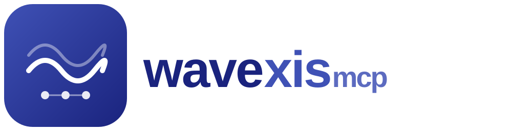

<!-- mcp-name: io.github.MathiasPaulenko/wavexis-mcp -->

<p align="center">
  
</p>

<h3 align="center">LLM向けMCPサーバー — 220個のブラウザ自動化ツール</h3>

<p align="center">
  <strong>Chrome + Firefox · CDP + BiDi · 100% Python · Node.js不要 · Chromiumダウンロード不要</strong>
</p>

---

[English](README.md) | [简体中文](README.zh-CN.md) | **日本語**

[](https://github.com/MathiasPaulenko/wavexis-mcp/actions/workflows/ci.yml)
[](https://pypi.org/project/wavexis-mcp/)
[](https://pypi.org/project/wavexis-mcp/)
[](https://pypi.org/project/wavexis-mcp/)
[](https://github.com/MathiasPaulenko/wavexis-mcp/actions/workflows/ci.yml)
[](https://github.com/MathiasPaulenko/wavexis-mcp/pkgs/container/wavexis-mcp)
[](https://github.com/MathiasPaulenko/wavexis-mcp/blob/main/LICENSE)
[](https://mathiaspaulenko.github.io/wavexis-mcp/)
[](https://smithery.ai/servers/mathias-paulenko/wavexis-mcp)

> [wavexis](https://github.com/MathiasPaulenko/wavexis) ブラウザ自動化ライブラリをLLM向けのMCPサーバーとして公開します。220個のツールを13の機能ティアに分割しています。Node.jsもChromiumのダウンロードも不要で、既存のChrome/Edgeをそのまま利用できます。100% Pythonです。

## クイックデモ

**最初のスクリーンショットまで30秒。** 次の内容をMCPクライアント設定（Claude Desktop、Cursor、Windsurf、VS Code）に追加してください。

```json
{
  "mcpServers": {
    "wavexis": {
      "command": "uvx",
      "args": ["wavexis-mcp", "--caps", "all"]
    }
  }
}
```

その後、LLMに次のように依頼します。

> *"https://example.com のフルページスクリーンショットを撮って"*

LLMは `wavexis_screenshot(url="https://example.com", full_page=true)` を呼び出し、スクリーンショットを返します。Node.jsもChromiumのダウンロードも不要で、上記の設定以外の準備は必要ありません。

## なぜWaveXisMCPなのか？

WaveXisMCPは [wavexis](https://github.com/MathiasPaulenko/wavexis) ブラウザ自動化ライブラリをラップし、[MCPサーバー](https://modelcontextprotocol.io/) として公開します。Node.js、Playwright、別途のChromiumダウンロードは不要です。WaveXisMCPは既存のChromeまたはEdgeを直接起動します。

### 主な機能

- **220個のツール** — Playwright MCP（21）の約3倍、zendriver-mcp（96）の約2倍
- **13の機能ティア** — `--caps` で必要なものだけを有効化。まず `core`（72ツール）から始め、必要に応じて追加
- **Chrome + Firefox** — Chrome/EdgeはCDP、FirefoxはBiDi。どちらもPATHからドライバーを自動起動
- **Chromiumダウンロード不要** — 既存ブラウザを利用。インストールサイズは約5MB（Playwright MCPは約400MB）
- **ステルスモード** — `stealth=true` で `navigator.webdriver` を隠し、plugins / languages / chrome runtime を偽装
- **構造化エラー** — すべてのエラーに `suggestion` フィールドがあり、LLMが人手なしで自己修正可能
- **マルチアクションYAML** — 1回のツール呼び出しで navigate → click → fill → screenshot を連結
- **生のCDP/BiDiアクセス** — 専用ツールがないブラウザ機能のための逃げ道
- **Lighthouse監査、WebAuthn、Bluetooth、Cast** — 他のMCPサーバーではカバーされないニッチな機能
- **SSRF保護、パスサンドボックス、レート制限** — 初日から組み込まれたセキュリティ
- **593テスト、90%カバレッジ強制、実ChromeでのE2E** — 本番利用に耐える品質

### 仕組み

```text
あなた（自然言語）
  → LLM が呼び出すツールを決定
    → WaveXisMCP がツール呼び出しを受信
      → wavexis ライブラリが CDP または BiDi で実行
        → Chrome/Edge/Firefox が操作を実行
      ← 結果を JSON で返却（テキスト、base64、ファイルパス）
    ← JSON を LLM に返却
  ← LLM が結果を要約
```

LLMはブラウザを直接見ることはありません。見えるのはツール定義（名前、説明、パラメータ）とJSONレスポンスだけです。そのため、MCP互換のLLMクライアントであれば追加のカスタム統合なしでそのまま動作します。

### 基本概念

- **ツール（Tool）** — スクリーンショット、eval、クリックなどの単一ブラウザ操作を、任意のLLMクライアントが呼べるMCPツールとして公開したものです。
- **セッション（Session）** — 永続的なブラウザインスタンスです。セッションを開き、複数のツール呼び出しをつなぎ、完了後に閉じます。操作ごとにブラウザを起動するオーバーヘッドを避けられます。
- **ステートレスモード（Stateless）** — 任意のツールに `url` パラメータを渡して呼び出します。ブラウザは起動、実行、終了まで自動で行われます。
- **機能ティア（Capability tiers）** — `core`（72ツール）から `all`（220ツール）までの13ティアです。`--caps` で必要なものだけを有効化します。
- **デュアルバックエンド（Dual backend）** — CDP（Chromiumネイティブ、cdpwave経由）とBiDi（W3Cクロスブラウザ、bidiwave経由）を、セッション単位で選択できます。
- **構造化エラー（Structured errors）** — すべてのエラーに `suggestion` フィールドがあり、LLMへ次に取るべき行動を示すことで、人手なしの自己修正が可能です。

## インストール

```bash
pip install wavexis-mcp
```

CDPバックエンド（Chromium）付き：

```bash
pip install "wavexis-mcp[cdp]"
```

またはインストールせずに実行（推奨）：

```bash
uvx wavexis-mcp
```

## 要件

- **Python**：3.11、3.12、または 3.13
- **ブラウザ**：Google Chrome、Microsoft Edge、または任意のChromium/Chrome系ブラウザ
- **BiDiバックエンド**（任意）：Chrome向けChromeDriver/EdgeDriver、またはFirefox向けgeckodriver

## クイックスタート

MCPクライアント設定（Claude Desktop、Cursor、Windsurf、VS Code）に追加してください。

```json
{
  "mcpServers": {
    "wavexis": {
      "command": "uvx",
      "args": ["wavexis-mcp", "--caps", "all"]
    }
  }
}
```

または pip を使う場合：

```json
{
  "mcpServers": {
    "wavexis": {
      "command": "wavexis-mcp",
      "args": ["--caps", "all"]
    }
  }
}
```

### ステートレスモード（ワンショット）

任意のツールに `url` パラメータを渡して呼び出します。ブラウザは起動、実行、終了まで自動で行われます。

```text
wavexis_screenshot(url="https://example.com", full_page=true)
```

### セッションモード（マルチステップ）

セッションを開き、複数のアクションをつなぎ、完了後に閉じます。

```text
wavexis_session_open(backend="cdp", headless=false)
→ {"session_id": "abc-123"}

wavexis_navigate(session_id="abc-123", url="https://example.com")
wavexis_click(session_id="abc-123", selector="#login")
wavexis_screenshot(session_id="abc-123")
wavexis_session_close(session_id="abc-123")
```

### 自然言語インタラクション（M1）

`wavexis_act` を使い、自然言語でページを操作します。

```text
wavexis_session_open(backend="cdp")
wavexis_navigate(session_id="abc-123", url="https://example.com")
wavexis_act(session_id="abc-123", instruction="click the login button")
→ {"action": "click", "element": {"ref": "el-3", "role": "button", "name": "Login"}, "status": "ok"}
```

`wavexis_act` ツールは a11y スナップショットを取得し、キーワードスコアリングで指示を要素に対応付け、検出されたアクション（click、type、fill、hover）を実行します。外部LLM呼び出しはなく、純粋なヒューリスティックマッチングです。

## 機能ティア

| ティア | フラグ | ツール数 | 主な機能 |
|------|------|-------|--------------|
| **Core** | 常時有効 | 72 | セッション、ナビゲーション、スクリーンショット、PDF、スクレイプ、eval、DOM、入力、cookies、タブ、自然言語操作、iframe、shadow DOM、イベント |
| **Network** | `--caps=network` | 20 | ヘッダー、UA、ブロック、スロットル、キャッシュ、HAR、intercept、mock、リクエスト/レスポンス変更、リクエストボディ、HAR再生、リクエスト一覧 |
| **Storage** | `--caps=storage` | 18 | localStorage、sessionStorage、cache storage、IndexedDB、状態の保存/復元 |
| **Emulation** | `--caps=emulation` | 9 | デバイス、ビューポート、位置情報、タイムゾーン、ダークモード、ロケール、CPU、タッチ、センサー |
| **A11y** | `--caps=a11y` | 4 | アクセシビリティツリーのスナップショット、ノード走査、axe-core監査 |
| **Interactions** | `--caps=interactions` | 5 | ダイアログ、ダウンロード、権限 |
| **DevTools** | `--caps=devtools` | 31 | パフォーマンス、CSS、デバッグ、overlay、コンソール、セキュリティ、ウィンドウ管理、複合trace、注釈付きスクリーンショット |
| **Vision** | `--caps=vision` | 7 | 座標ベースのマウス操作（ピクセル精度） |
| **Video** | `--caps=video` | 4 | 動画録画、チャプター、アクションオーバーレイ |
| **Testing** | `--caps=testing` | 6 | アサーション、ロケーター生成 |
| **Workflows** | `--caps=workflows` | 6 | マルチアクションYAML、生のCDP/BiDi、ブラウザコンテキストCRUD |
| **Data** | `--caps=data` | 7 | Codegen、Lighthouse監査、抽出、WebSocket intercept、クロール、ビジュアルdiff、Core Web Vitals |
| **Experimental** | `--caps=experimental` | 31 | Service workers、アニメーション、WebAuthn、WebAudio、メディア、cast、bluetooth、拡張機能、prefs |
| **合計** | `--caps=all` | **220** | |

**デフォルト**：`--caps=core`（72ツール）。すべて有効化：`--caps=all`。特定のみ：`--caps=network,storage,emulation`。

> **ヒント**：まず `--caps core` から始め、必要に応じてティアを追加してください。各ティアはLLMのコンテキストにツール定義を追加するため、トークンを消費します。多くの作業では `core,network,storage`（110ツール）が良いバランスです。

## バックエンド

WaveXisMCPは、機能パリティを保った2つのバックエンドをサポートします。

- **CDP**（cdpwave）— デフォルト。Chrome DevTools Protocol。Chrome/EdgeへWebSocketで直接接続。ドライバー不要。57のCDPドメイン。`pip install "wavexis-mcp[cdp]"`
- **BiDi**（bidiwave）— WebDriver BiDiプロトコル。W3Cクロスブラウザ（Firefox、Chrome）。Chromeはchromedriver、Firefoxはgeckodriverが必要で、未起動ならPATHから自動起動されます。`pip install "wavexis-mcp[bidi]"`

セッションごとに選択します。

```text
# CDP (default, Chrome/Edge only)
wavexis_session_open(backend="cdp")

# BiDi with Chrome (auto-launches chromedriver)
wavexis_session_open(backend="bidi", browser="chrome")

# BiDi with Firefox (auto-launches geckodriver)
wavexis_session_open(backend="bidi", browser="firefox")
```

### 既存のChromeへ接続

`connect_existing=True` を使うと、Chromeを `--remote-debugging-port` 付きで起動して接続できます。ログイン済みセッションを含むブラウザプロファイルの再利用に便利です。

```text
# Launch Chrome with debug port and connect via CDP
wavexis_session_open(connect_existing=true)

# Reuse an existing Chrome profile (keeps logins, cookies, extensions)
wavexis_session_open(connect_existing=true, user_data_dir="C:/Users/me/ChromeProfile")
```

Chromeはヘッド付きで起動されます（headlessは無視されます）。セッションを閉じると、ブラウザのサブプロセスも終了します。

## マルチアクションYAML

YAML文字列を渡すことで、1回のツール呼び出しに複数アクションを連結できます。

```text
wavexis_multi_action(
    config="""
actions:
  - navigate: https://example.com
  - screenshot:
      full_page: true
  - eval: document.title
  - click: "#login"
  - type:
      selector: "#username"
      text: admin@example.com
  - screenshot: {}
""",
    session_id="abc-123"
)
```

対応アクション種別：`navigate`、`screenshot`、`eval`、`click`、`type`、`fill`。失敗時も続行する場合は `continue_on_error: true` を設定してください。

## MCPリソースとプロンプト（M3）

**リソース（Resources）**（読み取り専用のブラウザ状態）：

- `wavexis://session/{id}/url` — 現在のページURL
- `wavexis://session/{id}/cookies` — cookies（JSON）
- `wavexis://session/{id}/console` — コンソールメッセージ
- `wavexis://session/{id}/tabs` — 開いているタブ

**プロンプト（Prompts）**（ワークフローテンプレート）：

- `scrape_page(url, selector)` — コンテンツのスクレイプと抽出
- `audit_page(url)` — 完全なa11y + パフォーマンス監査
- `fill_form(url, fields)` — ページ上のフォーム入力
- `debug_page(url)` — コンソール、ネットワーク、パフォーマンスのデバッグ

## HTTPトランスポート

CI/CD、共有インスタンス、Docker向けに、WaveXisMCPをHTTPサーバーとして実行できます。

```bash
# HTTP on localhost
wavexis-mcp --transport http --port 8765

# HTTP with all tiers
wavexis-mcp --transport http --port 8765 --caps all

# HTTP with remote access (use behind a reverse proxy!)
wavexis-mcp --transport http --allow-remote --port 8765
```

デフォルトでは `127.0.0.1` にバインドします。`0.0.0.0` にする場合は `--allow-remote` を使います。

## レート制限（M4）

セッション単位のトークンバケットによるレート制限です。

```bash
# 10 calls/sec, burst of 5
wavexis-mcp --rate-limit 10 --rate-burst 5
```

上限超過時は `{"error": "rate_limited", "retry_after_ms": N}` を返します。

## Docker

```bash
# Pull and run
docker run -p 8765:8765 ghcr.io/mathiaspaulenko/wavexis-mcp

# Or build locally
docker build -t wavexis-mcp .
docker run -p 8765:8765 wavexis-mcp

# Docker Compose
docker-compose up
```

詳細は [Dockerドキュメント](https://mathiaspaulenko.github.io/wavexis-mcp/docker/) を参照してください。

## 比較

| 機能 | Playwright MCP | **WaveXisMCP** |
|---------|:---:|:---:|
| 言語 | TypeScript | **Python** |
| Node.js必須 | ✗ | **✓（Node.js不要）** |
| Chromiumダウンロード（約200MB） | ✓ | **✗（既存ブラウザを使用）** |
| インストールサイズ | ~400MB | **~5MB** |
| コールドスタート | 3.2s | **0.8s** |
| ツール総数 | ~21 | **220** |
| 機能ティア（オプトイン） | ✗ | **✓（13ティア）** |
| デュアルプロトコル（CDP + BiDi） | ✗ | **✓** |
| Firefoxサポート | ✓（基本） | **✓（BiDi + geckodriver自動起動）** |
| バックエンド選択（セッション単位） | ✗ | **✓** |
| ステルス / アンチボットモード | ✗ | **✓** |
| 生のCDP/BiDiアクセス | ✗ | **✓（逃げ道）** |
| マルチアクションYAMLバッチ | ✗ | **✓** |
| 動画録画 | ✗ | **✓** |
| Lighthouse監査 | ✗ | **✓** |
| WebAuthn / Bluetooth / Cast | ✗ | **✓** |
| 自然言語インタラクション | ✗ | **✓（`wavexis_act`）** |
| MCPリソースとプロンプト | ✗ | **✓** |
| レート制限 | ✗ | **✓** |
| SSRF保護 | ✗ | **✓** |
| 提案付き構造化エラー | ✗ | **✓** |

> **注意**：Playwright MCPはWebKit（Safari）に対応していますが、WaveXisMCPは現時点では未対応です。今後の予定は [ロードマップ](https://github.com/MathiasPaulenko/wavexis-mcp/issues) を参照してください。

## ドキュメント

完全なドキュメント、APIリファレンス、サンプルは [mathiaspaulenko.github.io/wavexis-mcp](https://mathiaspaulenko.github.io/wavexis-mcp/) で公開しています。

主なセクション：

- [クイックスタート](https://mathiaspaulenko.github.io/wavexis-mcp/quickstart/)
- [アーキテクチャ](https://mathiaspaulenko.github.io/wavexis-mcp/architecture/)
- [設定](https://mathiaspaulenko.github.io/wavexis-mcp/configuration/)
- [Docker](https://mathiaspaulenko.github.io/wavexis-mcp/docker/)
- [HTTPトランスポート](https://mathiaspaulenko.github.io/wavexis-mcp/http-transport/)
- [レート制限](https://mathiaspaulenko.github.io/wavexis-mcp/rate-limiting/)
- [ツールリファレンス](https://mathiaspaulenko.github.io/wavexis-mcp/tools/core/)
- [サンプル](https://mathiaspaulenko.github.io/wavexis-mcp/examples/screenshot/)

## エラーハンドリング

すべてのツールは失敗時に構造化エラーJSONを返します。各エラーには、LLMを次のアクションへ導く `suggestion` フィールドが含まれます。

```json
{
  "error": "Session 'abc-123' not found.",
  "tool": "wavexis_navigate",
  "type": "SessionNotFoundError",
  "message": "Session 'abc-123' not found.",
  "suggestion": "Call wavexis_session_open first to create a browser session."
}
```

これにより、LLMは人手なしで自己修正できます。提案を読み取り、推奨されたツールを呼び出します。

## アーキテクチャ

WaveXisMCPは、3層エコシステムの最上位に位置します。

```text
WaveXisMCP（MCPサーバー、220ツール）
└─ wraps → wavexis（ブラウザ自動化ライブラリ）
               ├─ cdpwave（CDPバックエンド、Chromiumネイティブ）
               └─ bidiwave（BiDiバックエンド、W3Cクロスブラウザ）
```

- **cdpwave** — Chrome DevTools Protocol向けの低レベル非同期Pythonライブラリ。Chrome/EdgeへWebSocketで直接接続します。ドライバーバイナリは不要です。
- **bidiwave** — WebDriver BiDiプロトコル（W3C標準）向けの低レベル非同期Pythonライブラリ。Firefox、Chrome、Edgeで動作します。
- **wavexis** — cdpwaveとbidiwaveを統一された `AbstractBackend` インタフェースの背後に抽象化する、高レベルなブラウザ自動化ライブラリです。
- **WaveXisMCP** — wavexisをラップするMCPサーバーです。各バックエンドメソッドをMCPツールとして公開し、Pydantic v2による入力検証、JSONレスポンス、機能ティアによるフィルタリングを提供します。

全体設計、データフロー図、ADRについては [アーキテクチャドキュメント](https://mathiaspaulenko.github.io/wavexis-mcp/architecture/) を参照してください。

## 開発

```bash
git clone https://github.com/MathiasPaulenko/wavexis-mcp.git
cd wavexis-mcp
pip install -e ".[dev]"

# 品質チェックを実行
ruff check wavexis_mcp tests
ruff format --check
mypy wavexis_mcp
python -m bandit -r wavexis_mcp

# テストを実行
pytest tests/unit -v
```

## コントリビューション

コントリビューションを歓迎します。開発ワークフロー、コーディング規約、プルリクエストの手順については [CONTRIBUTING.md](CONTRIBUTING.md) を参照してください。セキュリティ問題については [SECURITY.md](SECURITY.md) を参照してください。

## 謝辞

WaveXisMCPは [wavexis](https://github.com/MathiasPaulenko/wavexis) ブラウザ自動化ライブラリと [Model Context Protocol](https://modelcontextprotocol.io/) の上に構築されています。本プロジェクトを支えてくれるツールと標準を提供してくださった、オープンソースのPythonおよびMCPコミュニティに感謝します。

## ライセンス

MIT

<!-- mcp-name: io.github.MathiasPaulenko/wavexis-mcp -->
mcp-name: io.github.MathiasPaulenko/wavexis-mcp
