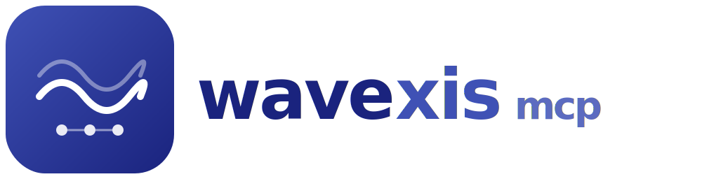

<p align="center">
  
</p>

MCP server that exposes the [wavexis](https://github.com/MathiasPaulenko/wavexis) browser automation library to LLMs.

**172 tools** across **13 capability tiers**. 100% Python, no Node.js, no Chromium download — uses your existing Chrome/Edge.

---

## What is WaveXisMCP?

WaveXisMCP is a [Model Context Protocol](https://modelcontextprotocol.io/) server that gives LLMs the ability to control a real web browser. Instead of writing browser automation code yourself, you configure WaveXisMCP as an MCP server in your LLM client (Claude Desktop, Cursor, Windsurf, VS Code), and the LLM can then take screenshots, click buttons, fill forms, scrape pages, run audits, record videos, and much more — all through natural language requests.

### How it works

```text
You (natural language)
  → LLM decides which tool to call
    → WaveXisMCP receives the tool call
      → wavexis library executes it via CDP or BiDi
        → Chrome/Edge performs the action
      ← Result returned as JSON (text, base64, file path)
    ← JSON passed back to LLM
  ← LLM summarizes the result for you
```

The LLM never sees the browser directly. It only sees tool definitions (name, description, parameters) and JSON responses. This means any MCP-compatible LLM client works out of the box — no custom integrations needed.

### Why not just use Playwright MCP?

| Concern | Playwright MCP | WaveXisMCP |
|---------|---------------|------------|
| Language | TypeScript / Node.js | **Python** |
| Chromium download | ~200MB bundled | **Uses your existing Chrome/Edge** |
| Install size | ~200MB+ | **~5MB** |
| Tool count | ~70 | **172** |
| Capability tiers | Flat | **13 tiers, opt-in via `--caps`** |
| Protocol | CDP only | **CDP + BiDi (cross-browser)** |
| Raw protocol access | No | **Yes (`wavexis_raw_cdp`, `wavexis_raw_bidi`)** |
| Video recording | No | **Yes** |
| Lighthouse audit | No | **Yes** |
| WebAuthn / Bluetooth | No | **Yes** |
| Natural language interaction | No | **Yes (`wavexis_act`)** |
| MCP resources & prompts | No | **Yes** |
| Rate limiting | No | **Yes (token bucket per session)** |

## Key features

- **Zero install** — uses your local Chrome/Edge, no 200MB Chromium download (~5MB package)
- **172 tools** — the most comprehensive browser automation MCP server
- **Dual backend** — CDP (Chromium-native, via cdpwave) and BiDi (W3C cross-browser, via bidiwave) with per-session selection
- **13 capability tiers** — enable only what you need via `--caps` to keep tool lists manageable for the LLM
- **Python-native** — no Node.js runtime required, pure Python 3.11+
- **Dual mode** — stateless one-shot calls (pass `url=`) or persistent sessions (open → chain calls → close)
- **Structured errors** — every error includes an actionable suggestion for the LLM
- **MCP resources & prompts** — expose browser state as resources and workflow templates as prompts
- **Rate limiting** — per-session token bucket to protect the browser from runaway LLM loops

## Ecosystem

```text
WaveXisMCP (MCP server, 172 tools)
└─ wraps → wavexis (browser automation library)
               ├─ cdpwave (CDP backend, Chromium-native)
               └─ bidiwave (BiDi backend, W3C cross-browser)
```

WaveXisMCP sits at the top of a three-layer ecosystem:

- **cdpwave** — low-level async Python library for the Chrome DevTools Protocol (CDP). Direct WebSocket to Chrome/Edge. No driver binary needed. Covers 57 CDP domains.
- **bidiwave** — low-level async Python library for the WebDriver BiDi protocol (W3C standard). Works with Firefox, Chrome, and Edge. Requires ChromeDriver/EdgeDriver.
- **wavexis** — high-level browser automation library that abstracts cdpwave and bidiwave behind a unified `AbstractBackend` interface. Provides 45+ action files covering navigation, screenshots, DOM, input, network, storage, emulation, accessibility, debugging, and more.
- **WaveXisMCP** — MCP server wrapping wavexis. Exposes each backend method as an MCP tool with Pydantic v2 input validation, JSON responses, and capability tier filtering.

## Quick links

- [Quick Start](quickstart.md) — install, configure, first tool call
- [Configuration](configuration.md) — capability tiers, CLI flags, environment variables
- [Architecture](architecture.md) — system design, data flow, ADRs
- [HTTP Transport](http-transport.md) — running as an HTTP server
- [Docker](docker.md) — containerized deployment
- [Tools reference](tools/core.md) — all 172 tools documented by tier
- [Examples](examples/screenshot.md) — real-world usage patterns

## License

MIT © Mathias Paulenko
